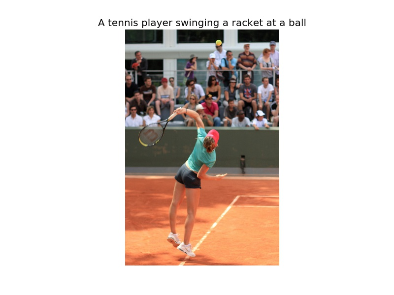
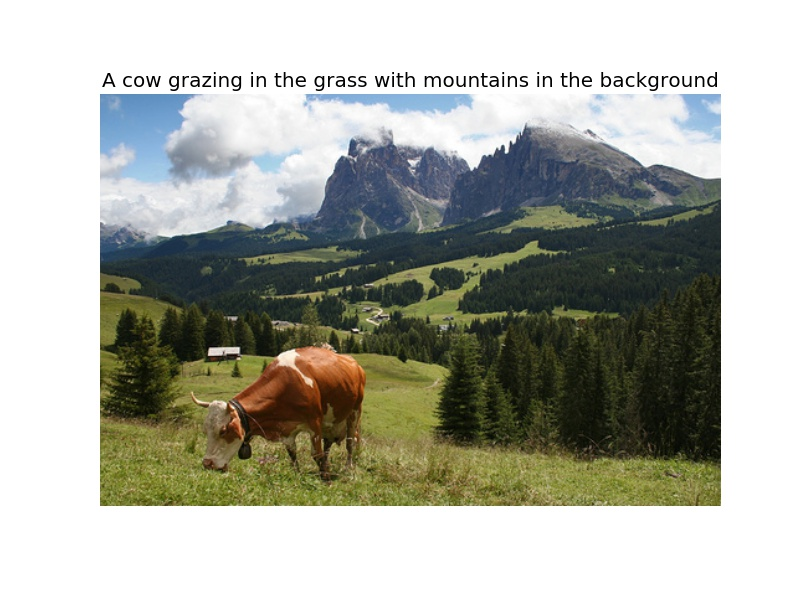
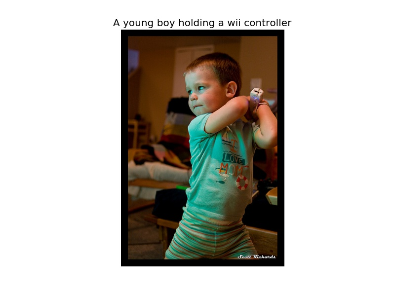
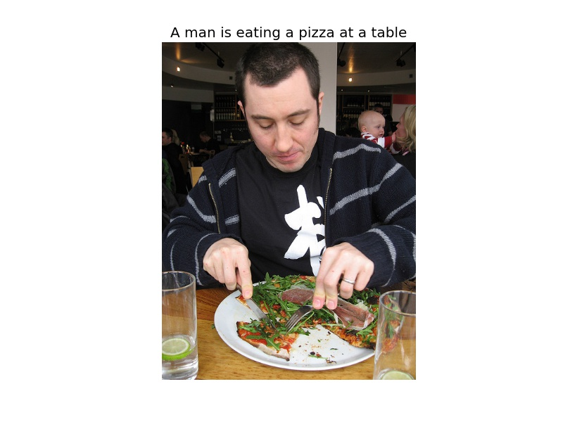
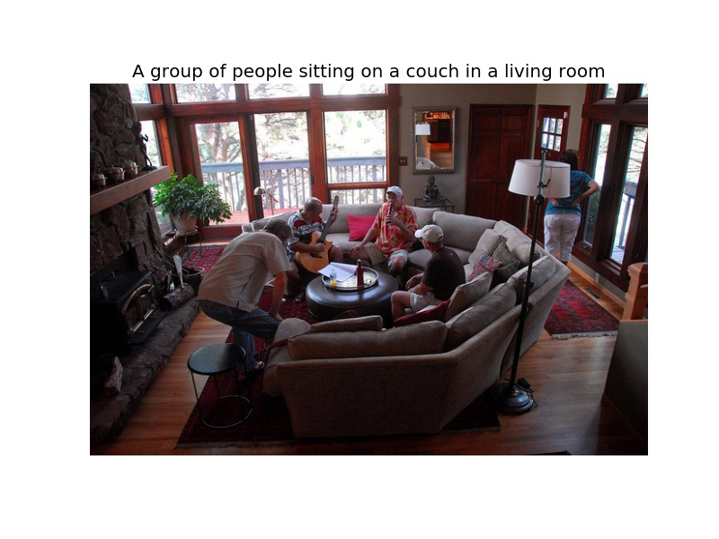
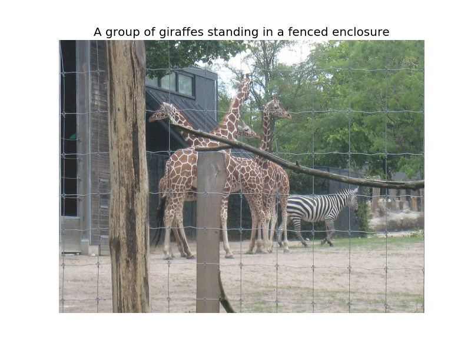
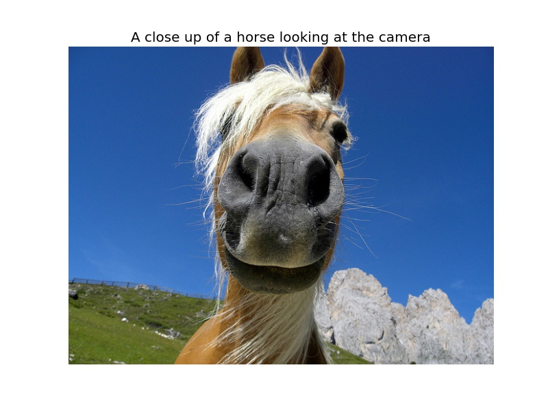
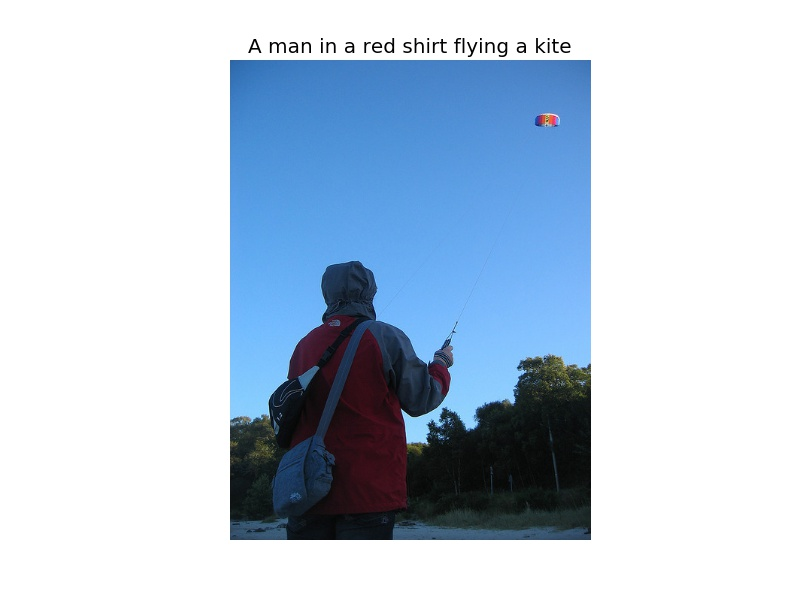
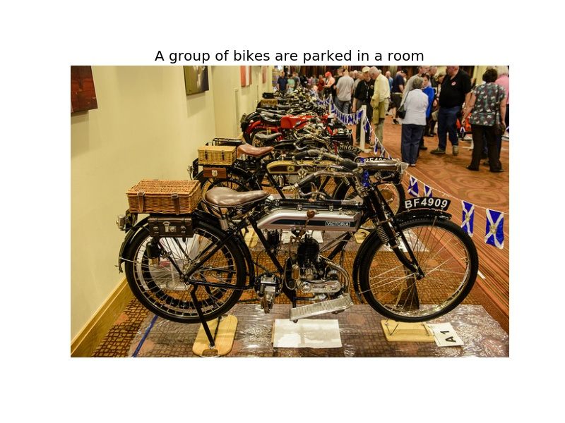

This is a neural network architecture for image captioning roughly based on the paper "Show, Attend and Tell: Neural Image Caption Generation with Visual Attention" by Xu et al. (ICML2015). The input is an image, and the output is a sentence describing the content of the image. It first uses a convolutional neural network to extract a feature vector of the input image, and then uses a LSTM recurrent neural network to decode this feature vector into a natural language sentence. A soft attention mechanism is incorporated to improve the quality of the caption. 

This project is implemented in Tensorflow, and allows end-to-end training of both CNN and RNN parts. To use it, you will need the Tensorflow version of VGG16 or ResNet(50, 101, 152) model, which can be obtained by using Caffe-to-Tensorflow. 

Examples
----------

References
----------

* [Show, Attend and Tell: Neural Image Caption Generation with Visual Attention](https://arxiv.org/abs/1502.03044). Kelvin Xu, Jimmy Ba, Ryan Kiros, Kyunghyun Cho, Aaron Courville, Ruslan Salakhutdinov, Richard Zemel, Yoshua Bengio. ICML 2015.
* [The original implementation in Theano](https://github.com/kelvinxu/arctic-captions)
* [An earlier implementation in Tensorflow](https://github.com/jazzsaxmafia/show_attend_and_tell.tensorflow)
* [Microsoft COCO dataset](http://mscoco.org/)
* [Caffe to Tensorflow](https://github.com/ethereon/caffe-tensorflow)

